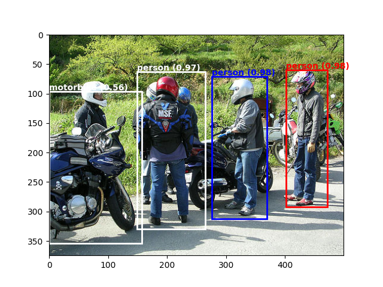

# Faster R-CNN
A simple and easy-to-use implementation of Faster R-CNN in PyTorch.



## Usage
First, install the dependencies:
```bash
pip install -r requirements.txt
```
### Training
To train a model, run:
```bash
python train.py \
    --ckpt_dir [CKPT_DIR] \
    --device cuda \
    --epochs 10
```
where:
- `CKPT_DIR` is the directory where the model checkpoints will be saved.

### Testing
To test a model, run:
```bash
python test.py \
    --ckpt_dir [CKPT_DIR] \
    --image_path [IMAGE_PATH] \
    --score_thresh 0.6
```
where:
- `CKPT_DIR` is the directory where the model checkpoints are saved.
- `IMAGE_PATH` is the path to the image to be tested.
- `SCORE_THRESH` is the threshold of confident score for the detected bounding boxes.